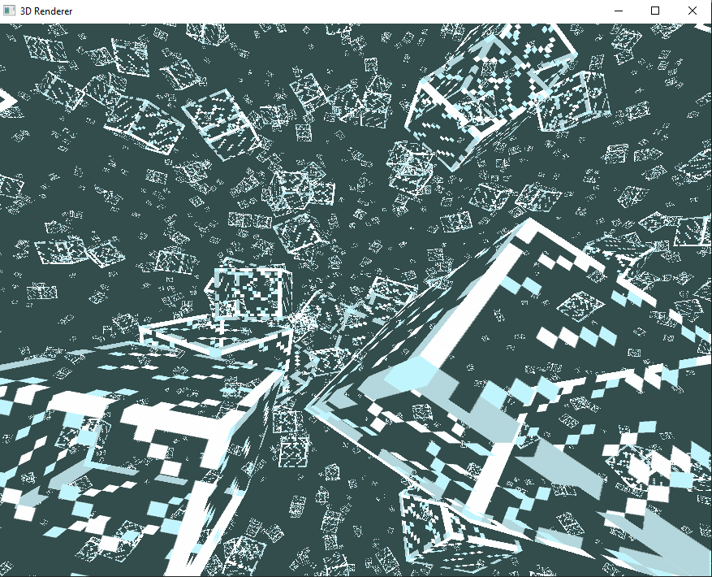
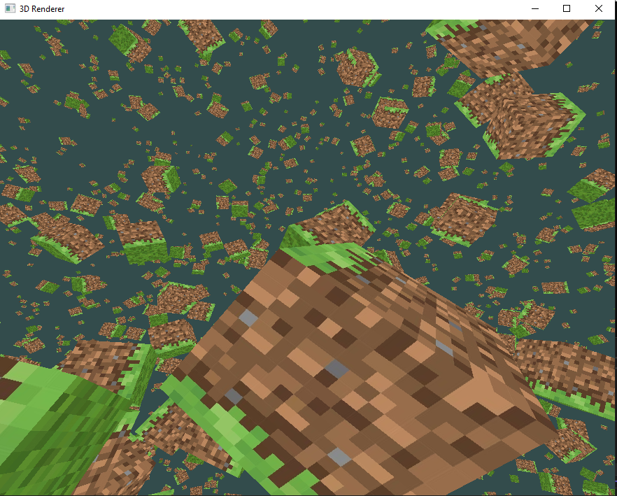
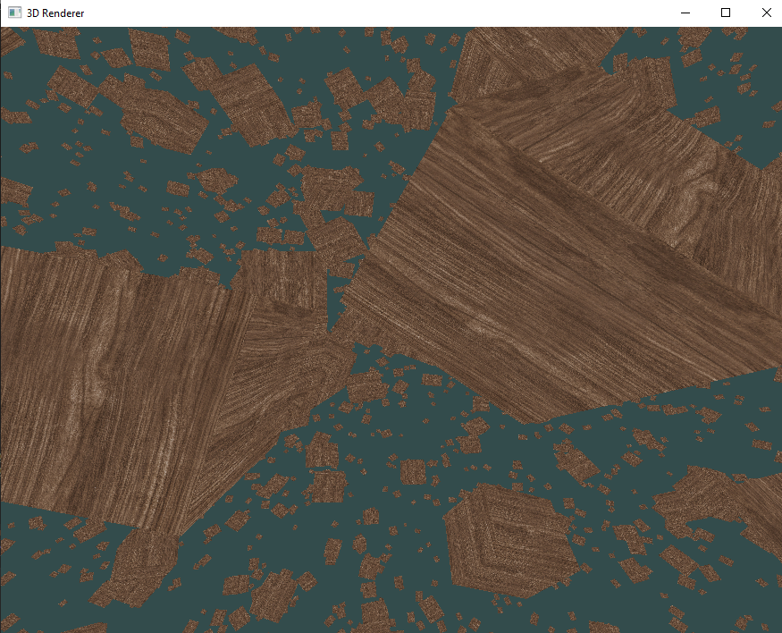

# 3D OpenGL Renderer

A modern 3D graphics renderer built with C++ and OpenGL, featuring dynamic scene generation, texture mapping, and interactive camera controls.

## Screenshots

### Minecraft Glass Block Rendering


### Minecraft Grass Block Rendering  


### Wood Texture Mapping


## Features

- **3D Cube Rendering** with customizable colors and textures
- **Dynamic Scene Generation** with multiple layout patterns
- **Texture Mapping** support with wood and Minecraft-style textures
- **First-Person Camera System** with mouse look and WASD controls
- **Real-time Rendering** with depth testing and efficient buffer management

## Controls

| Key | Action |
|-----|--------|
| `W` | Move forward |
| `S` | Move backward |
| `A` | Strafe left |
| `D` | Strafe right |
| `Space` | Move up |
| `Left Shift` | Move down |
| `Mouse` | Look around |
| `Escape` | Exit application |

## Technical Features

- **Modular Architecture** with separate rendering components
- **Shader System** supporting both basic and textured rendering
- **Matrix Mathematics** for 3D transformations
- **Vertex Buffer Management** with dynamic layouts
- **Index Buffer Optimization** for efficient rendering

## Getting Started

### Prerequisites
- Visual Studio 2019 or later
- OpenGL 3.3+
- GLFW, GLEW, stb_image libraries

### Installation
1. Clone the repository
2. Open `OpenGlProject1.sln` in Visual Studio
3. Build and run (F5)

## Usage Examples

```cpp
// Render a scene with 100 cubes using wood texture
renderer.renderScene("myScene", 100, "wood");

// Enable camera controls
renderer.enableCamera(window);

// Draw individual objects
renderer.drawMinecraftBlock(0.5f, 0.5f, 0.5f);
```

## Built With

- **C++** - Core language
- **OpenGL** - Graphics API
- **GLFW** - Window management
- **GLEW** - OpenGL extension loading
- **stb_image** - Texture loading
